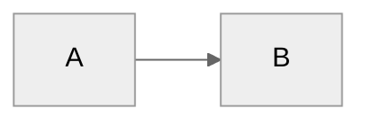
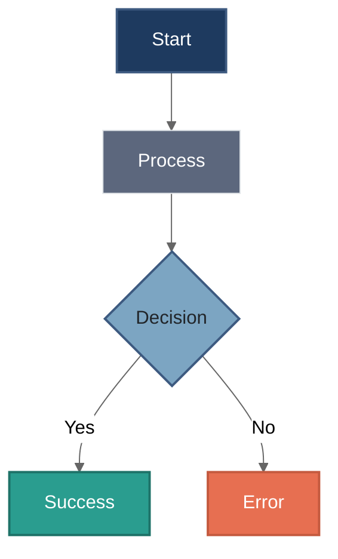
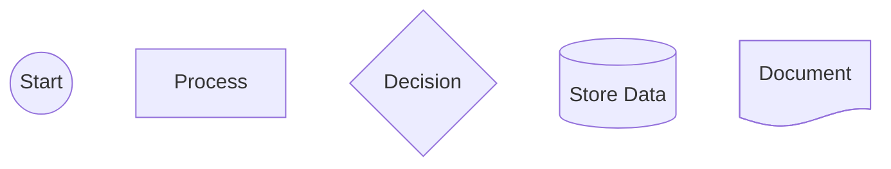
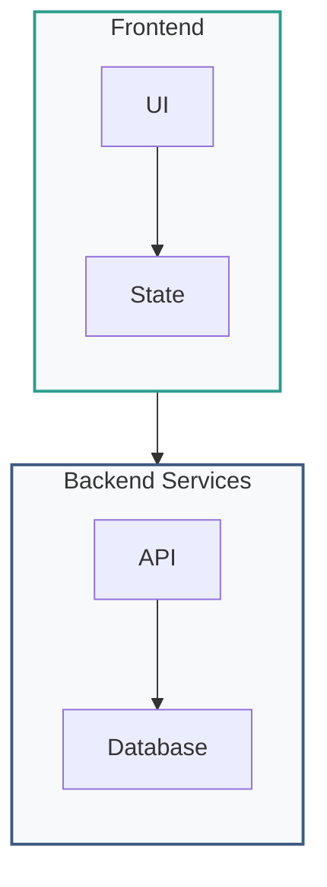
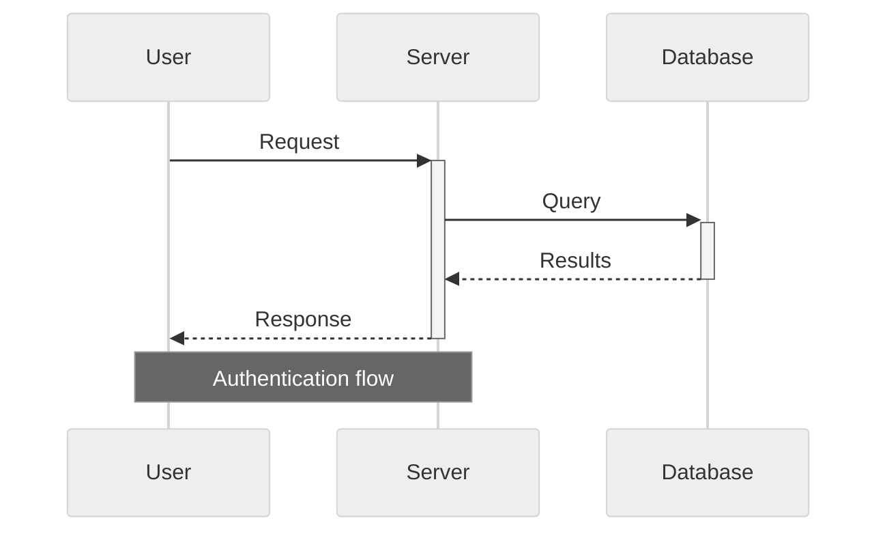

# Mermaid Syntax & Styling Reference

## Theme Configuration

ALWAYS use the `neutral` theme via frontmatter at the top of every diagram:



Available themes (prefer `neutral` for professional output):

| Theme | Description |
|-------|-------------|
| `neutral` | Clean black and white, best for documents and exports (DEFAULT) |
| `default` | Standard colorful theme |
| `forest` | Green shades |
| `dark` | For dark backgrounds |
| `base` | Customizable base theme |

## Professional Color Palette

Use this blue professional palette for custom styling. ALWAYS use hex codes, never color names.

| Purpose | Color | Hex |
|---------|-------|-----|
| Primary | Deep Blue | `#1e3a5f` |
| Primary Light | Steel Blue | `#3d5a80` |
| Secondary | Slate | `#5c677d` |
| Accent | Sky Blue | `#7ca5c2` |
| Highlight | Bright Blue | `#4a90d9` |
| Success | Teal | `#2a9d8f` |
| Warning | Amber | `#e9c46a` |
| Error | Coral | `#e76f51` |
| Background | Light Gray | `#f8f9fa` |
| Border | Medium Gray | `#dee2e6` |
| Text Dark | Charcoal | `#212529` |
| Text Light | White | `#ffffff` |

## Node Styling with classDef

Define reusable styles with `classDef` and apply with `:::` or `class`:



### Applying Classes

- Inline: `A[Label]:::className`
- Multiple nodes: `class nodeA,nodeB,nodeC className`
- Default for all: `classDef default fill:#f8f9fa,stroke:#dee2e6,stroke-width:1px`

## Modern Node Shapes (v11.3.0+)

Use the semantic shape syntax for clearer diagrams:



### Shape Reference

| Shape | Syntax | Use For |
|-------|--------|---------|
| Rectangle | `@{ shape: rect }` | Standard process |
| Rounded | `@{ shape: rounded }` | Events, soft steps |
| Diamond | `@{ shape: diamond }` | Decisions |
| Circle | `@{ shape: circle }` | Start/connection points |
| Database | `@{ shape: database }` | Data storage |
| Document | `@{ shape: doc }` | Documents |
| Stadium | `@{ shape: stadium }` | Terminal points |
| Subprocess | `@{ shape: subprocess }` | Subroutines |
| Hexagon | `@{ shape: hexagon }` | Preparation steps |
| Parallelogram | `@{ shape: lean-r }` | Input/Output |
| Cylinder | `@{ shape: cyl }` | Database/storage |
| Double Circle | `@{ shape: dbl-circ }` | End/stop points |
| Stacked Rect | `@{ shape: st-rect }` | Multiple processes |
| Stacked Doc | `@{ shape: docs }` | Multiple documents |

## Link Styling

Style individual links by index (0-based):

```
linkStyle 0 stroke:#4a90d9,stroke-width:2px
linkStyle 1,2,3 stroke:#5c677d,stroke-width:1px
```

### Link Types

| Type | Syntax | Description |
|------|--------|-------------|
| Arrow | `-->` | Standard arrow |
| Open | `---` | No arrowhead |
| Dotted | `-.->` | Dotted with arrow |
| Thick | `==>` | Bold arrow |
| Text | `--\|label\|-->` | Arrow with label |

## Subgraph Styling

Group related nodes with styled subgraphs:



## Sequence Diagram Styling



## Complete Professional Example

```mermaid
---
config:
  theme: neutral
---
flowchart TD
    classDef primary fill:#1e3a5f,stroke:#3d5a80,stroke-width:2px,color:#ffffff
    classDef process fill:#3d5a80,stroke:#1e3a5f,stroke-width:1px,color:#ffffff
    classDef decision fill:#7ca5c2,stroke:#3d5a80,stroke-width:2px,color:#212529
    classDef success fill:#2a9d8f,stroke:#1e7268,stroke-width:2px,color:#ffffff
    classDef error fill:#e76f51,stroke:#c45a3f,stroke-width:2px,color:#ffffff
    classDef data fill:#f8f9fa,stroke:#dee2e6,stroke-width:1px,color:#212529

    Start@{ shape: circle, label: "Start" }:::primary
    Input@{ shape: lean-r, label: "User Input" }:::data
    Validate@{ shape: rect, label: "Validate" }:::process
    Check@{ shape: diamond, label: "Valid?" }:::decision
    Process@{ shape: rect, label: "Process Data" }:::process
    Store@{ shape: database, label: "Save to DB" }:::data
    Success@{ shape: rounded, label: "Success" }:::success
    Error@{ shape: rounded, label: "Error" }:::error

    Start --> Input
    Input --> Validate
    Validate --> Check
    Check -->|Yes| Process
    Check -->|No| Error
    Process --> Store
    Store --> Success

    linkStyle 0,1,2 stroke:#3d5a80,stroke-width:2px
    linkStyle 3 stroke:#2a9d8f,stroke-width:2px
    linkStyle 4 stroke:#e76f51,stroke-width:2px
    linkStyle 5,6 stroke:#3d5a80,stroke-width:2px
```
